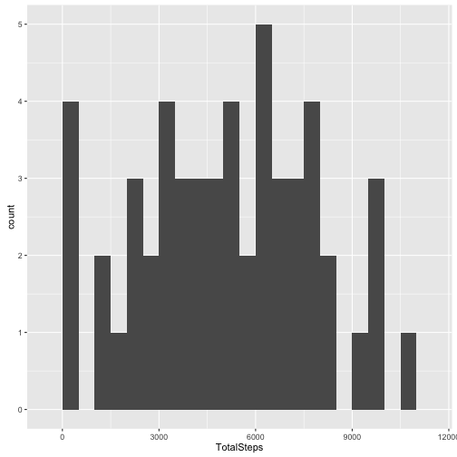
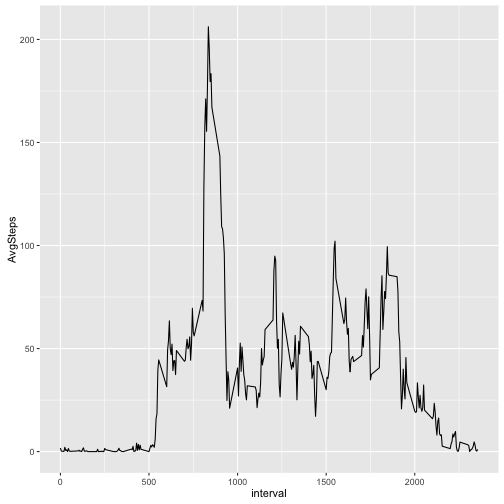
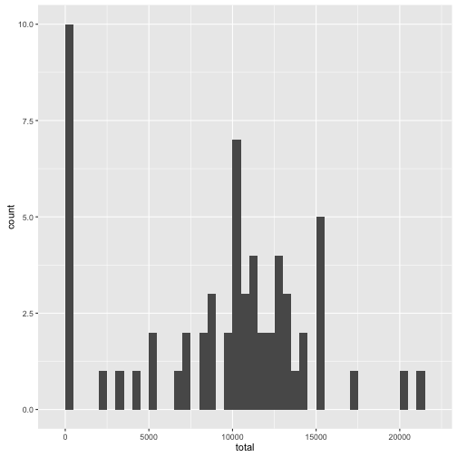
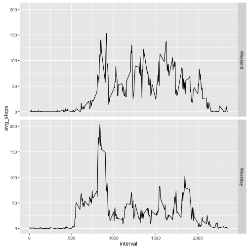

```
## Warning: package 'xtable' was built under R version 3.1.3
```

---
title: "Reproducible Research: Peer Assessment 1"
output: 
  html_document:
    keep_md: true
---


## Loading and preprocessing the data

### Source Data

The CSV source data is unpacked from the provided archive and loaded into R as a data frame.


```r
ensureActivityData <- function(srcFileName = "activity.csv", archiveName = "activity.zip", baseDir = ".") {
  activitySrcPath <- file.path(baseDir, srcFileName);
  if (!file.exists(activitySrcPath)) {
    unzip(zipfile = file.path(baseDir, archiveName), overwrite = TRUE, exdir = baseDir);
  }
  
  return (read.csv(activitySrcPath, stringsAsFactors = FALSE))
}
```
Create a dataframe from the source data (unzipping it if it has not been already)

```r
raw_df <- ensureActivityData();
```
Add a parsed date field in order to plot the time-series graphs

```r
df <- data.frame(raw_df, date_time = strptime(paste(raw_df$date, sapply(raw_df$interval, zeroPadInterval)), "%F %H%M"));
```

<!-- html table generated in R 3.1.2 by xtable 1.8-2 package -->
<!-- Thu Feb 11 09:12:00 2016 -->
<table border=1>
<tr> <th>  </th> <th> steps </th> <th> date </th> <th> interval </th> <th> date_time </th>  </tr>
  <tr> <td align="right"> 1 </td> <td align="right">  </td> <td> 2012-10-01 </td> <td align="right">   0 </td> <td> 2012-10-01 00:00:00 </td> </tr>
  <tr> <td align="right"> 2 </td> <td align="right">  </td> <td> 2012-10-01 </td> <td align="right">   5 </td> <td> 2012-10-01 00:05:00 </td> </tr>
  <tr> <td align="right"> 3 </td> <td align="right">  </td> <td> 2012-10-01 </td> <td align="right">  10 </td> <td> 2012-10-01 00:10:00 </td> </tr>
  <tr> <td align="right"> 4 </td> <td align="right">  </td> <td> 2012-10-01 </td> <td align="right">  15 </td> <td> 2012-10-01 00:15:00 </td> </tr>
  <tr> <td align="right"> 5 </td> <td align="right">  </td> <td> 2012-10-01 </td> <td align="right">  20 </td> <td> 2012-10-01 00:20:00 </td> </tr>
  <tr> <td align="right"> 6 </td> <td align="right">  </td> <td> 2012-10-01 </td> <td align="right">  25 </td> <td> 2012-10-01 00:25:00 </td> </tr>
   </table>

## What is mean total number of steps taken per day?  

The src data is aggregated based on date as below:  

<!-- html table generated in R 3.1.2 by xtable 1.8-2 package -->
<!-- Thu Feb 11 09:12:00 2016 -->
<table border=1>
<tr> <th>  </th> <th> date </th> <th> avg_steps </th>  </tr>
  <tr> <td align="right"> 1 </td> <td> 2012-10-01 </td> <td align="right">  </td> </tr>
  <tr> <td align="right"> 2 </td> <td> 2012-10-02 </td> <td align="right"> 0.00 </td> </tr>
  <tr> <td align="right"> 3 </td> <td> 2012-10-03 </td> <td align="right"> 79.30 </td> </tr>
  <tr> <td align="right"> 4 </td> <td> 2012-10-04 </td> <td align="right"> 96.87 </td> </tr>
  <tr> <td align="right"> 5 </td> <td> 2012-10-05 </td> <td align="right"> 93.60 </td> </tr>
  <tr> <td align="right"> 6 </td> <td> 2012-10-06 </td> <td align="right"> 71.50 </td> </tr>
  <tr> <td align="right"> 7 </td> <td> 2012-10-07 </td> <td align="right"> 73.74 </td> </tr>
  <tr> <td align="right"> 8 </td> <td> 2012-10-08 </td> <td align="right">  </td> </tr>
  <tr> <td align="right"> 9 </td> <td> 2012-10-09 </td> <td align="right"> 110.61 </td> </tr>
  <tr> <td align="right"> 10 </td> <td> 2012-10-10 </td> <td align="right"> 46.74 </td> </tr>
  <tr> <td align="right"> 11 </td> <td> 2012-10-11 </td> <td align="right"> 75.68 </td> </tr>
  <tr> <td align="right"> 12 </td> <td> 2012-10-12 </td> <td align="right"> 104.31 </td> </tr>
  <tr> <td align="right"> 13 </td> <td> 2012-10-13 </td> <td align="right"> 83.43 </td> </tr>
  <tr> <td align="right"> 14 </td> <td> 2012-10-14 </td> <td align="right"> 57.55 </td> </tr>
  <tr> <td align="right"> 15 </td> <td> 2012-10-15 </td> <td align="right"> 72.95 </td> </tr>
  <tr> <td align="right"> 16 </td> <td> 2012-10-16 </td> <td align="right"> 140.23 </td> </tr>
  <tr> <td align="right"> 17 </td> <td> 2012-10-17 </td> <td align="right"> 76.81 </td> </tr>
  <tr> <td align="right"> 18 </td> <td> 2012-10-18 </td> <td align="right"> 24.12 </td> </tr>
  <tr> <td align="right"> 19 </td> <td> 2012-10-19 </td> <td align="right"> 67.69 </td> </tr>
  <tr> <td align="right"> 20 </td> <td> 2012-10-20 </td> <td align="right"> 25.46 </td> </tr>
  <tr> <td align="right"> 21 </td> <td> 2012-10-21 </td> <td align="right"> 43.72 </td> </tr>
  <tr> <td align="right"> 22 </td> <td> 2012-10-22 </td> <td align="right"> 37.56 </td> </tr>
  <tr> <td align="right"> 23 </td> <td> 2012-10-23 </td> <td align="right"> 32.91 </td> </tr>
  <tr> <td align="right"> 24 </td> <td> 2012-10-24 </td> <td align="right"> 50.34 </td> </tr>
  <tr> <td align="right"> 25 </td> <td> 2012-10-25 </td> <td align="right"> 14.59 </td> </tr>
  <tr> <td align="right"> 26 </td> <td> 2012-10-26 </td> <td align="right"> 38.00 </td> </tr>
  <tr> <td align="right"> 27 </td> <td> 2012-10-27 </td> <td align="right"> 71.31 </td> </tr>
  <tr> <td align="right"> 28 </td> <td> 2012-10-28 </td> <td align="right"> 62.27 </td> </tr>
  <tr> <td align="right"> 29 </td> <td> 2012-10-29 </td> <td align="right"> 34.07 </td> </tr>
  <tr> <td align="right"> 30 </td> <td> 2012-10-30 </td> <td align="right"> 65.16 </td> </tr>
  <tr> <td align="right"> 31 </td> <td> 2012-10-31 </td> <td align="right"> 86.01 </td> </tr>
  <tr> <td align="right"> 32 </td> <td> 2012-11-01 </td> <td align="right">  </td> </tr>
  <tr> <td align="right"> 33 </td> <td> 2012-11-02 </td> <td align="right"> 55.64 </td> </tr>
  <tr> <td align="right"> 34 </td> <td> 2012-11-03 </td> <td align="right"> 70.58 </td> </tr>
  <tr> <td align="right"> 35 </td> <td> 2012-11-04 </td> <td align="right">  </td> </tr>
  <tr> <td align="right"> 36 </td> <td> 2012-11-05 </td> <td align="right"> 53.96 </td> </tr>
  <tr> <td align="right"> 37 </td> <td> 2012-11-06 </td> <td align="right"> 42.01 </td> </tr>
  <tr> <td align="right"> 38 </td> <td> 2012-11-07 </td> <td align="right"> 80.91 </td> </tr>
  <tr> <td align="right"> 39 </td> <td> 2012-11-08 </td> <td align="right"> 0.00 </td> </tr>
  <tr> <td align="right"> 40 </td> <td> 2012-11-09 </td> <td align="right">  </td> </tr>
  <tr> <td align="right"> 41 </td> <td> 2012-11-10 </td> <td align="right">  </td> </tr>
  <tr> <td align="right"> 42 </td> <td> 2012-11-11 </td> <td align="right"> 76.00 </td> </tr>
  <tr> <td align="right"> 43 </td> <td> 2012-11-12 </td> <td align="right"> 80.77 </td> </tr>
  <tr> <td align="right"> 44 </td> <td> 2012-11-13 </td> <td align="right"> 40.02 </td> </tr>
  <tr> <td align="right"> 45 </td> <td> 2012-11-14 </td> <td align="right">  </td> </tr>
  <tr> <td align="right"> 46 </td> <td> 2012-11-15 </td> <td align="right"> 0.00 </td> </tr>
  <tr> <td align="right"> 47 </td> <td> 2012-11-16 </td> <td align="right"> 37.81 </td> </tr>
  <tr> <td align="right"> 48 </td> <td> 2012-11-17 </td> <td align="right"> 118.98 </td> </tr>
  <tr> <td align="right"> 49 </td> <td> 2012-11-18 </td> <td align="right"> 48.12 </td> </tr>
  <tr> <td align="right"> 50 </td> <td> 2012-11-19 </td> <td align="right"> 69.47 </td> </tr>
  <tr> <td align="right"> 51 </td> <td> 2012-11-20 </td> <td align="right"> 25.28 </td> </tr>
  <tr> <td align="right"> 52 </td> <td> 2012-11-21 </td> <td align="right"> 101.48 </td> </tr>
  <tr> <td align="right"> 53 </td> <td> 2012-11-22 </td> <td align="right"> 167.34 </td> </tr>
  <tr> <td align="right"> 54 </td> <td> 2012-11-23 </td> <td align="right"> 0.00 </td> </tr>
  <tr> <td align="right"> 55 </td> <td> 2012-11-24 </td> <td align="right"> 46.00 </td> </tr>
  <tr> <td align="right"> 56 </td> <td> 2012-11-25 </td> <td align="right"> 33.23 </td> </tr>
  <tr> <td align="right"> 57 </td> <td> 2012-11-26 </td> <td align="right"> 77.35 </td> </tr>
  <tr> <td align="right"> 58 </td> <td> 2012-11-27 </td> <td align="right"> 50.88 </td> </tr>
  <tr> <td align="right"> 59 </td> <td> 2012-11-28 </td> <td align="right"> 49.47 </td> </tr>
  <tr> <td align="right"> 60 </td> <td> 2012-11-29 </td> <td align="right"> 32.16 </td> </tr>
  <tr> <td align="right"> 61 </td> <td> 2012-11-30 </td> <td align="right">  </td> </tr>
   </table>
  
#### 1. Make a histogram of the total number of steps taken each day

```
## Warning: Removed 8 rows containing non-finite values (stat_bin).
```


  
  
#### 2. Calculate and report the mean and median total number of steps taken per day

```r
meanPerDay <- mean(dailySum$TotalSteps, na.rm=T);
medianPerDay <- median(dailySum$TotalSteps, na.rm=T);
```

The mean of the input data is 5087.1698113.  
The median of the input data is 5188.  

## What is the average daily activity pattern?

#### 1. Make a time series plot (i.e. type = "l") of the 5-minute interval (x-axis) and the average number of steps taken, averaged across all days (y-axis)


```r
aggregatedByInterval <- aggregate(cleanDf$steps, by=list(interval = cleanDf$interval), FUN = mean);
names(aggregatedByInterval) <- c("interval", "AvgSteps")
  
avgIntervalTsPlot <- ggplot(aggregatedByInterval) + geom_line(aes(interval, AvgSteps))
print(avgIntervalTsPlot);
```



#### 2. Which 5-minute interval, on average across all the days in the dataset, contains the maximum number of steps?

```r
maxAvgStepsInterval <- aggregatedByInterval[(aggregatedByInterval$AvgSteps == max(aggregatedByInterval$AvgSteps)), ][1,1]
```

The interval during the day with the highest average step count over all days in the data set is 835.  

## Imputing missing values

#### 1. Calculate and report the total number of missing values in the dataset (i.e. the total number of rows with `NA`s)

There are 2304 values that are `NA`, which represents 13.1147541 percent of the dataset  

#### 2. Devise a strategy for filling in all of the missing values in the dataset. The strategy does not need to be sophisticated. For example, you could use the mean/median for that day, or the mean for that 5-minute interval, etc.

For each `NA` reading, this will be replaced for the average steps taken for that day. If a particular day had no readings, it is given the value `0`;

#### 3. Create a new dataset that is equal to the original dataset but with the missing data filled in.

```r
chooseMeanOrValueOnNA <- function(steps, mean) {
  if(is.na(steps)) {
    return (mean);
  } else {
    return (steps);
  }
}

withMean <- data.frame(df, with_mean = sapply(df$date, addAverageForRespectiveDay, averages=dailyMean));
imputed_activity <- data.frame(withMean, imputed_steps = mapply(FUN=chooseMeanOrValueOnNA, steps=withMean$steps, mean=withMean$with_mean));

imputed_table <- xtable(head(imputed_activity[(is.na(imputed_activity$steps) | (imputed_activity$steps != 0)), c("date", "interval", "steps", "imputed_steps")], 25), );
print(imputed_table, "html")
```

<!-- html table generated in R 3.1.2 by xtable 1.8-2 package -->
<!-- Thu Feb 11 09:12:02 2016 -->
<table border=1>
<tr> <th>  </th> <th> date </th> <th> interval </th> <th> steps </th> <th> imputed_steps </th>  </tr>
  <tr> <td align="right"> 1 </td> <td> 2012-10-01 </td> <td align="right">   0 </td> <td align="right">  </td> <td align="right"> 0.00 </td> </tr>
  <tr> <td align="right"> 2 </td> <td> 2012-10-01 </td> <td align="right">   5 </td> <td align="right">  </td> <td align="right"> 0.00 </td> </tr>
  <tr> <td align="right"> 3 </td> <td> 2012-10-01 </td> <td align="right">  10 </td> <td align="right">  </td> <td align="right"> 0.00 </td> </tr>
  <tr> <td align="right"> 4 </td> <td> 2012-10-01 </td> <td align="right">  15 </td> <td align="right">  </td> <td align="right"> 0.00 </td> </tr>
  <tr> <td align="right"> 5 </td> <td> 2012-10-01 </td> <td align="right">  20 </td> <td align="right">  </td> <td align="right"> 0.00 </td> </tr>
  <tr> <td align="right"> 6 </td> <td> 2012-10-01 </td> <td align="right">  25 </td> <td align="right">  </td> <td align="right"> 0.00 </td> </tr>
  <tr> <td align="right"> 7 </td> <td> 2012-10-01 </td> <td align="right">  30 </td> <td align="right">  </td> <td align="right"> 0.00 </td> </tr>
  <tr> <td align="right"> 8 </td> <td> 2012-10-01 </td> <td align="right">  35 </td> <td align="right">  </td> <td align="right"> 0.00 </td> </tr>
  <tr> <td align="right"> 9 </td> <td> 2012-10-01 </td> <td align="right">  40 </td> <td align="right">  </td> <td align="right"> 0.00 </td> </tr>
  <tr> <td align="right"> 10 </td> <td> 2012-10-01 </td> <td align="right">  45 </td> <td align="right">  </td> <td align="right"> 0.00 </td> </tr>
  <tr> <td align="right"> 11 </td> <td> 2012-10-01 </td> <td align="right">  50 </td> <td align="right">  </td> <td align="right"> 0.00 </td> </tr>
  <tr> <td align="right"> 12 </td> <td> 2012-10-01 </td> <td align="right">  55 </td> <td align="right">  </td> <td align="right"> 0.00 </td> </tr>
  <tr> <td align="right"> 13 </td> <td> 2012-10-01 </td> <td align="right"> 100 </td> <td align="right">  </td> <td align="right"> 0.00 </td> </tr>
  <tr> <td align="right"> 14 </td> <td> 2012-10-01 </td> <td align="right"> 105 </td> <td align="right">  </td> <td align="right"> 0.00 </td> </tr>
  <tr> <td align="right"> 15 </td> <td> 2012-10-01 </td> <td align="right"> 110 </td> <td align="right">  </td> <td align="right"> 0.00 </td> </tr>
  <tr> <td align="right"> 16 </td> <td> 2012-10-01 </td> <td align="right"> 115 </td> <td align="right">  </td> <td align="right"> 0.00 </td> </tr>
  <tr> <td align="right"> 17 </td> <td> 2012-10-01 </td> <td align="right"> 120 </td> <td align="right">  </td> <td align="right"> 0.00 </td> </tr>
  <tr> <td align="right"> 18 </td> <td> 2012-10-01 </td> <td align="right"> 125 </td> <td align="right">  </td> <td align="right"> 0.00 </td> </tr>
  <tr> <td align="right"> 19 </td> <td> 2012-10-01 </td> <td align="right"> 130 </td> <td align="right">  </td> <td align="right"> 0.00 </td> </tr>
  <tr> <td align="right"> 20 </td> <td> 2012-10-01 </td> <td align="right"> 135 </td> <td align="right">  </td> <td align="right"> 0.00 </td> </tr>
  <tr> <td align="right"> 21 </td> <td> 2012-10-01 </td> <td align="right"> 140 </td> <td align="right">  </td> <td align="right"> 0.00 </td> </tr>
  <tr> <td align="right"> 22 </td> <td> 2012-10-01 </td> <td align="right"> 145 </td> <td align="right">  </td> <td align="right"> 0.00 </td> </tr>
  <tr> <td align="right"> 23 </td> <td> 2012-10-01 </td> <td align="right"> 150 </td> <td align="right">  </td> <td align="right"> 0.00 </td> </tr>
  <tr> <td align="right"> 24 </td> <td> 2012-10-01 </td> <td align="right"> 155 </td> <td align="right">  </td> <td align="right"> 0.00 </td> </tr>
  <tr> <td align="right"> 25 </td> <td> 2012-10-01 </td> <td align="right"> 200 </td> <td align="right">  </td> <td align="right"> 0.00 </td> </tr>
   </table>
#### 4. Make a histogram of the total number of steps taken each day and Calculate and report the mean and median total number of steps taken per day. Do these values differ from the estimates from the first part of the assignment? What is the impact of imputing missing data on the estimates of the total daily number of steps?

```r
imputedDailyTotal <- aggregate(imputed_activity$imputed_steps, by=list(date = imputed_activity$date), FUN = sum)
names(imputedDailyTotal) <- c("date", "total");
imputedDailyTotalHist <- ggplot(imputedDailyTotal) + geom_histogram(aes(total), binwidth=500);
print(imputedDailyTotalHist);
```




```r
meanImputedPerDay <- mean(imputedDailyTotal$total);
medianImputedPerDay <- median(imputedDailyTotal$total);
```

The mean of the imputed data is 9354.2295082.  
The median of the imputed data is 1.0395 &times; 10<sup>4</sup>.    

The impact of imputing the data is that the median and mean for the daily usage is generally higher, and additionally the overall usage based on the histogram is more evenly distributed.  

## Are there differences in activity patterns between weekdays and weekends?

#### 1. Create a new factor variable in the dataset with two levels -- "weekday" and "weekend" indicating whether a given date is a weekday or weekend day.

```r
dayType <- factor(c("Weekend", "Weekday"));
calendarizedAdjustedActivity <- data.frame(imputed_activity, type = sapply(imputed_activity$date, dayTypeFunc));

calendarizedAdjustedActivity.withFormattedDates <- calendarizedAdjustedActivity;
calendarizedAdjustedActivity.withFormattedDates[, "date_time"] <- as.character(calendarizedAdjustedActivity.withFormattedDates[, "date_time"]);
xta <- xtable(head(calendarizedAdjustedActivity.withFormattedDates), )
print(xta, "html")
```

<!-- html table generated in R 3.1.2 by xtable 1.8-2 package -->
<!-- Thu Feb 11 09:12:03 2016 -->
<table border=1>
<tr> <th>  </th> <th> steps </th> <th> date </th> <th> interval </th> <th> date_time </th> <th> with_mean </th> <th> imputed_steps </th> <th> type </th>  </tr>
  <tr> <td align="right"> 1 </td> <td align="right">  </td> <td> 2012-10-01 </td> <td align="right">   0 </td> <td> 2012-10-01 00:00:00 </td> <td align="right"> 0.00 </td> <td align="right"> 0.00 </td> <td> Weekday </td> </tr>
  <tr> <td align="right"> 2 </td> <td align="right">  </td> <td> 2012-10-01 </td> <td align="right">   5 </td> <td> 2012-10-01 00:05:00 </td> <td align="right"> 0.00 </td> <td align="right"> 0.00 </td> <td> Weekday </td> </tr>
  <tr> <td align="right"> 3 </td> <td align="right">  </td> <td> 2012-10-01 </td> <td align="right">  10 </td> <td> 2012-10-01 00:10:00 </td> <td align="right"> 0.00 </td> <td align="right"> 0.00 </td> <td> Weekday </td> </tr>
  <tr> <td align="right"> 4 </td> <td align="right">  </td> <td> 2012-10-01 </td> <td align="right">  15 </td> <td> 2012-10-01 00:15:00 </td> <td align="right"> 0.00 </td> <td align="right"> 0.00 </td> <td> Weekday </td> </tr>
  <tr> <td align="right"> 5 </td> <td align="right">  </td> <td> 2012-10-01 </td> <td align="right">  20 </td> <td> 2012-10-01 00:20:00 </td> <td align="right"> 0.00 </td> <td align="right"> 0.00 </td> <td> Weekday </td> </tr>
  <tr> <td align="right"> 6 </td> <td align="right">  </td> <td> 2012-10-01 </td> <td align="right">  25 </td> <td> 2012-10-01 00:25:00 </td> <td align="right"> 0.00 </td> <td align="right"> 0.00 </td> <td> Weekday </td> </tr>
   </table>

#### 2. Make a panel plot containing a time series plot (i.e. type = "l") of the 5-minute interval (x-axis) and the average number of steps taken, averaged across all weekday days or weekend days (y-axis).     


```r
weekendData <- calendarizedAdjustedActivity[calendarizedAdjustedActivity$type == "Weekend", c("interval", "imputed_steps")];
weekendAverage <- data.frame(aggregate(weekendData$imputed_steps, by=list(interval = weekendData$interval), FUN = mean), type="Weekend");
  
weekdayData <- calendarizedAdjustedActivity[calendarizedAdjustedActivity$type == "Weekday", c("interval", "imputed_steps")]
weekdayAverage <- data.frame(aggregate(weekdayData$imputed_steps, by=list(interval = weekdayData$interval), FUN = mean), type="Weekday");

combined <- rbind(weekendAverage, weekdayAverage);
names(combined) <- c("interval", "avg_steps", "type");
```




## Supporting functions

```r
zeroPadInterval <- function(intervalStr) {
  zeros <- rep(0, 4-nchar(as.character(intervalStr)));
  result <- paste0(paste0(zeros, collapse=""), as.character(intervalStr), collapse="")
  return (result);
}

# takes a date string and returns a string (level) indicating whether its a weekday or a weekend
dayTypeFunc <- function(date) {
  d <- strptime(date, format = "%F");
  day <- weekdays(d);
  if (day == "Saturday" | day == "Sunday") {
    return ("Weekend")
  } else return ("Weekday");
}

addAverageForRespectiveDay <- function(date, averages) {
  avg <- averages[(averages$Date == date), "MeanSteps"]
  if (is.na(avg)) return (0);
  return (avg);
}
```
